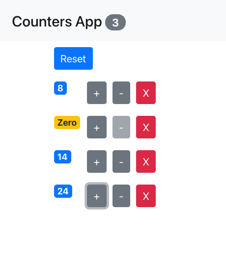

# Counter App

## Description

A basic React app created during "Mastering React", a React.js course taught by Mosh Hamedani on [Code With Mosh](https://codewithmosh.com/)!

## Table of Contents

- [Counter App](#counter-app)
  - [Description](#description)
  - [Table of Contents](#table-of-contents)
  - [Screenshot](#screenshot)
  - [Installation](#installation)
  - [Questions](#questions)

## Screenshot

## Installation

Using the terminal, clone the repository to your local device using SSH or HTTPS. Once cloned, open repository in a text editor to make changes.

## Questions

Created by: [Youngin9210](https://github.com/Youngin9210)

For any further information or questions please contact me at [kyleyoung.9210@gmail.com](mailto:kyleyoung.9210@gmail.com)
